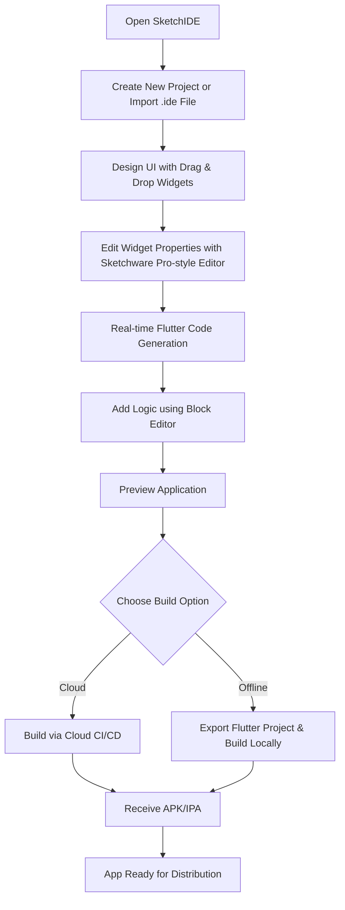
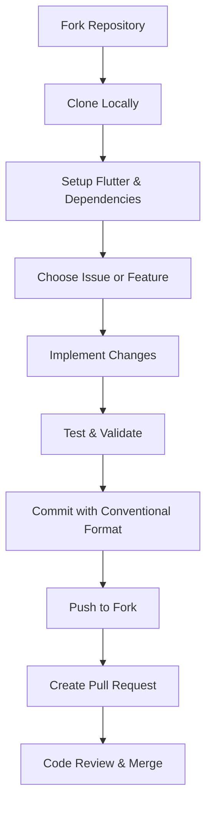

<p align="center">
  
</p>

# 📊 SketchIDE

<p align="center">
  <a href="https://t.me/sketchidegroup">
    
  </a>
  <a href="https://t.me/sketchide">
    
  </a>
  
  
  
  
</p>

**SketchIDE** is an offline mobile IDE that allows anyone to build **native Android & iOS apps visually** – no coding required. Inspired by Sketchware Pro but built using **Flutter** for modern, cross-platform compatibility.

> **🚀 Recent Updates**: SketchIDE now features a complete **Sketchware Pro-compatible** drag & drop system with enhanced ViewDummy, advanced touch controllers, comprehensive property validation, and a full set of frame widgets. The visual editor perfectly matches Sketchware Pro's behavior while using modern Flutter architecture.

---

## 🌟 Core Features

* **Block-based Visual Programming** (logic without typing code)
* **Drag-and-Drop UI Builder** with Material 3 widgets
* **Sketchware Pro-style Property Editor** with color-coded property boxes
* **Sequential Widget ID Generation** (text1, text2, text3, etc.)
* **Smart Widget Management** with auto-selection and CRUD operations
* **Real-time Flutter Code Generation** from visual widgets
* **Project File Management** (main.dart, custom pages, widgets)
* **Project Export** in `.ide` format (like Sketchware `.swb`)
* **Code Preview & Editor** (for advanced users)
* **Offline Builds**

  * **Option 1:** Export Flutter project → Build locally with Android Studio/Xcode
  * **Option 2:** Cloud CI/CD build (Codemagic / GitHub Actions)
* **Scoped Storage Compliant** (projects stored in sandbox)
* **Cross‑platform Output:** Android (APK/AAB) & iOS (IPA)
* **Plugin System** for custom components and blocks

---

## 🎨 Latest Features (v2.0)

### **Sketchware Pro-style Property Editor**
- **Color-coded Property Boxes**: Each property type has its own color and icon
- **Smart Layout**: 100x70px property boxes with headers and values
- **Property Types**: Text (Blue), Size (Green), Color (Purple), Number (Orange), Spacing (Teal), Boolean (Indigo)
- **See All Button**: Floating button to access full property editor

### **Sequential Widget ID Generation**
- **Smart Naming**: `text1`, `text2`, `text3` instead of random timestamps
- **Type-based Counting**: Automatically counts existing widgets of the same type
- **Clean IDs**: Easy to identify and manage widgets

### **Smart Widget Management**
- **Auto-selection**: When a widget is deleted, automatically selects the next available widget
- **Property Panel Visibility**: Shows when widgets exist, hides when none are available
- **CRUD Operations**: Create, Read, Update, Delete widgets with visual feedback
- **Success Messages**: Confirmation messages for all operations

### **Enhanced ViewDummy System**
- **Sketchware Pro Exact Match**: ViewDummy behavior perfectly matches Sketchware Pro
- **Semi-transparent Widget Preview**: Shows 50% opacity copy of dragged widget at drop location
- **No Double Shadows**: Fixed duplicate visual feedback issue
- **Invalid Drop Feedback**: Red cancel icon when dragging over invalid areas

### **Advanced Touch Controller System**
- **Native-like Touch Handling**: Mimics Android native touch behavior exactly
- **Touch Variables**: Uses same variable names as Sketchware Pro (`t`, `u`, `v`)
- **Gesture Detection**: Tap, long press, and drag with proper thresholds
- **Touch State Management**: Complete touch lifecycle handling

### **Property Validation Service**
- **Comprehensive Validation**: Reserved keywords, method names, pattern matching
- **Sketchware Pro Rules**: Exact same validation rules as Sketchware Pro
- **Real-time Feedback**: Instant validation with error messages
- **Type-specific Validation**: Color, numeric, text, URL, email validation

### **Frame Widgets System**
- **Complete Widget Set**: Text, Button, Container, Row, Column, Stack, Icon, TextField
- **Sketchware Pro Styling**: Exact same visual appearance and behavior
- **Touch Integration**: Perfect integration with touch controller system
- **Selection Visual**: Same selection color (`0x9599d5d0`) as Sketchware Pro

### **Real-time Flutter Code Generation**
- **Live Code Updates**: Widget changes immediately reflect in generated Dart code
- **File Management**: Supports main.dart and custom page files
- **Code Synchronization**: Visual widgets stay in sync with generated code
- **Default Hello World**: New projects start with a complete Flutter app structure

---

## 📱 How Users Create Apps in SketchIDE



---

## 🐽 Roadmap

* [x] Create project
* [x] UI Canvas with drag & drop
* [x] Widget property editor (Sketchware Pro style)
* [x] Sequential widget ID generation
* [x] Widget CRUD operations (Create, Read, Update, Delete)
* [x] Auto-selection and smart property panel
* [x] Flutter code generation from widgets
* [x] Project file management (main.dart, custom pages)
* [x] Enhanced ViewDummy system (Sketchware Pro exact match)
* [x] Advanced touch controller system
* [x] Property validation service
* [x] Frame widgets implementation (Text, Button, Container, etc.)
* [x] Selection service and visual feedback
* [ ] Logic block editor (Blockly)
* [ ] Project import/export (`.ide`)
* [ ] Android offline APK builder
* [ ] iOS Xcode project exporter
* [ ] Custom widget templates
* [ ] Marketplace for templates

---

## Folder Structure

```bash
SketchIDE/
├── lib/
│   ├── controllers/                # Touch and interaction controllers
│   │   ├── drag_controller.dart
│   │   ├── mobile_frame_touch_controller.dart
│   │   └── selection_controller.dart
│   │
│   ├── data/                       # Data persistence layer
│   │   ├── repositories/
│   │   └── datasources/
│   │
│   ├── models/                     # Data models and beans
│   │   ├── flutter_widget_bean.dart
│   │   ├── sketchide_project.dart
│   │   ├── project_info.dart
│   │   └── view_info.dart
│   │
│   ├── services/                   # Business logic services
│   │   ├── property_validation_service.dart
│   │   ├── view_info_service.dart
│   │   ├── selection_service.dart
│   │   ├── flutter_code_generator_service.dart
│   │   ├── project_service.dart
│   │   └── widget_factory_service.dart
│   │
│   ├── viewmodels/                 # MVVM view models
│   │   ├── design_viewmodel.dart
│   │   ├── project_viewmodel.dart
│   │   └── property_viewmodel.dart
│   │
│   ├── views/                      # UI screens and pages
│   │   ├── project_list_view.dart
│   │   ├── design_activity_screen.dart
│   │   └── sketchide_project_creation.dart
│   │
│   ├── widgets/                    # UI widgets and components
│   │   ├── frame_items/            # Sketchware Pro-style frame widgets
│   │   │   ├── frame_text.dart
│   │   │   ├── frame_button.dart
│   │   │   ├── frame_container.dart
│   │   │   ├── frame_row.dart
│   │   │   ├── frame_column.dart
│   │   │   ├── frame_stack.dart
│   │   │   ├── frame_icon.dart
│   │   │   └── frame_text_field.dart
│   │   ├── property_items/         # Property editor components
│   │   ├── widget_items/           # Widget palette items
│   │   ├── flutter_device_frame.dart
│   │   ├── widget_palette.dart
│   │   ├── property_panel.dart
│   │   ├── view_dummy.dart
│   │   └── design_drawer.dart
│   │
│   └── main.dart                   # App Entry Point
│
├── assets/                         # Icons, images, templates
│   ├── icons/
│   └── images/
│
├── android/                        # Android platform files
├── ios/                           # iOS platform files
├── fastlane/                      # Play Store Metadata
└── Sketchware-Pro/                # Reference implementation
```

---

## 🧰 Contributor Workflow



### Roles

* **UI Builder Team**: Drag & drop widgets
* **Block Editor Team**: Logic block engine
* **Build/Export Team**: Android & iOS build pipeline
* **Core System Team**: Database & project handling
* **QA Team**: Unit and widget testing

---

## 🤝 How to Contribute

1. **Fork** this repo
2. **Clone & Setup:** `flutter pub get`
3. **Pick an Issue** from GitHub Issues
4. **Develop & Test** locally
5. **Submit Pull Request** with description

#### Commit Types

* `feat:` new feature
* `fix:` bug fix
* `design:` UI/UX change
* `refactor:` internal improvements
* `test:` testing related
* `docs:` documentation

---

## ⚠️ Permissions & Guidelines

### **Storage Policy**
- Do **not** modify **Scoped Storage policies** (required for Google Play compliance).
- Avoid uninstalling the app **before upgrading** to prevent project loss.

### **Why Scoped Storage?**
- Google Play policies no longer allow unrestricted file access.
- **SketchIDE** follows these rules to ensure app stability and compliance.

### **How SketchIDE Handles Files**
- Projects are stored securely in the **App Sandbox**:  
  `/Android/data/com.sketchide.app/files/projects`
- **Export/Import** uses **SAF (Storage Access Framework)** for safe file handling.

### **Benefits**
- No risk of Play Store rejection.
- Secure and future-proof file storage.
- Easy **backup** and **restore** process.

---

## 📢 Support & Feedback

* **Telegram Group:** [Join](https://t.me/sketchidegroup)
* **Telegram Channel:** [Updates](https://t.me/sketchide)
* **Email:** [developerrajendrahelp@gmail.com](mailto:developerrajendrahelp@gmail.com)

---

## 🎉 License

SketchIDE is licensed under **MIT** and **CC BY 4.0**.

```text
SketchIDE is free software: you can redistribute it and/or modify it under the terms of both the MIT License and the Creative Commons Attribution 4.0 International License (CC BY 4.0).

It is distributed in the hope that it will be useful, but WITHOUT ANY WARRANTY; without even the implied warranty of MERCHANTABILITY or FITNESS FOR A PARTICULAR PURPOSE.
```

View licenses: [MIT](https://opensource.org/licenses/MIT) | [CC BY 4.0](https://creativecommons.org/licenses/by/4.0/)

---

**🎉 Happy Coding with SketchIDE! 🎉**
